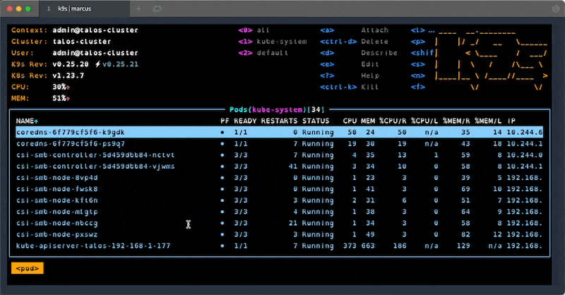
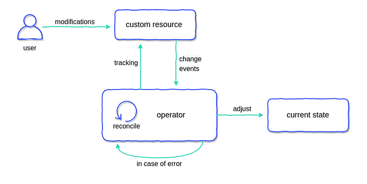

This post is based on a [webinar i've previously given](https://www.youtube.com/watch?v=SLysG0QWiG4) where I go through some of my favourite tips for working with Kubernetes clusters all day long. The goal of all of these techniques is to make my life easier and (hopefully) less error prone. I start off with the first 5 tips being applicable to anyone working with Kubernetes and can be picked up right away. From there I move on to a couple that would benefit from having some old-skool Linux sys-admin experience. Finally I finish of with some more advanced techniques that require some previous programming experience.

## #0 - Pay someone else to do it

Yeah, ok, this one is a little tongue-in-cheek as this is what we provide at [Giant Swarm](https://www.giantswarm.io/) but it is worth thinking about.

If you have dozens or even hundreds of clusters, on-top of standard development work, you’re going to be stretched thin. Getting someone else to manage things while you focus on what makes your business money can often be the right choice.

## #1 - Love your Terminal

It doesn’t matter if your shell of choice is Bash, ZSH, Fish or even Powershell you’ll benefit greatly from learning the ins-and-outs of your terminal of choice.

Many shell implementations have some variation of “rc” files - often referred to as “dotfiles”. In bash, it’s a file called `.bashrc`, in ZSH it’s `.zshrc`. Generally these are found in your users home directory. These files are interpreted by your shell each time a new session (tab/window) is opened and allows you to set up defaults and customisations. One of my favourite uses for these session files is to create custom aliases for functions (or groups of functions) that I use often to help me (try to) avoid typos and “fat fingering” when typing out long commands.

Many people share their custom “dotfiles” on GitHub or similar and are a great source of neat tricks and handy shortcuts. My dotsfiles can be found on GitHub at [AverageMarcus/dotfiles](https://github.com/averagemarcus/dotfiles).

## #2 - Learn to Love `kubectl`

Everything you might want to do with a Kubernetes cluster can be acomplished with the help of `kubectl`. Learning how to master this handy little CLI can go a long way to mastering Kubernetes cluster management.

The official documentation offers a single page view of all built in commands that is a great place to start if you’re not sure of a command: [kubectl-commands](https://kubernetes.io/docs/reference/generated/kubectl/kubectl-commands).

Building on tip #1, my most used command is `k`, an alias I have set up for `kubectl` to save on keystrokes. Add the following to your relevant ‘rc’ file:

```bash
alias k='kubectl'
```

Once this is in your terminal session, you can do something like the following:

```bash
k get pods
```

(You’ll see more of this alias in the other examples used in this post)

`kubectl` even has a very handy command to find out everything you need to know about the properties of any Kubernetes resource - [kubectl explain](https://kubernetes.io/docs/reference/generated/kubectl/kubectl-commands#explain)

```bash
# k explain pods.spec.containers
KIND: Pod
VERSION: v1

RESOURCE: containers <[]Object>

DESCRIPTION:
```

I find this most useful when you can’t access the official docs or your know exactly the field you’re interested in.

## #3 - Multiple Kubeconfigs

When dealing with multiple Kubernetes clusters your kubeconfig file can very quickly become an unwieldy mess.

Thankfully there are some tools available to make it more manageable by making it quick and easy to switch between cluster context.

* kubectx and kubens - <https://github.com/ahmetb/kubectx>
* kubeswitch - <https://github.com/danielfoehrKn/kubeswitch>
* kubie - <https://github.com/sbstp/kubie>

`kubeswitch` is my current favourite as it supports loading kubeconfigs from a directory of yaml files, allowing me to export the kubeconfig of each cluster to their own file. I had previously had this same multi-file setup with just `kubectl` by combining multiple files in the `KUBECONFIG` environment variable with a `:` (see below) but I found that many tools didn’t support this and attempted to treat the value as a single file path.

Multi-file kubeconfig hack, expecting files to be in the `~/.kube/clusters` directory:

```bash
## Merge multiple kubeconfigs
function join_by { local d=$1; shift; echo -n "$1"; shift; printf "%s" "${@/#/$d}"; }
KUBECONFIG="$HOME/.kube/config"
OTHER_CLUSTERS="$(join_by :$HOME/.kube/clusters/ $(echo $HOME/.kube/clusters/$(/bin/ls $HOME/.kube/clusters)))"
export KUBECONFIG=$KUBECONFIG:$OTHER_CLUSTERS
```

I recommend using one of the tools listed above rather than this shell hack.

## #4 - k9s

[k9s](<https://github.com/derailed/k9s/>) is one of my favourite tools when working with clusters. It provides an interactive terminal that supports all resource types and actions, lots of keybinding and filtering. Once you learn all the shortcuts and features, this handy tool will save you a lot of time when working with problematic clusters.

<figure class="center" markdown="1">



<figcaption>k9s in action!</figcaption>
</figure>

## #5 - `kubectl` plugins

Just like Kubernetes itself, `kubectl` can be extended to provide more powerful functionality via a plugin mechanism, there’s even a package manager available to help discover plugins - [Krew](https://github.com/kubernetes-sigs/krew).

But you don’t need a package manager, or really anything too fancy, to add plugins to `kubectl`. Any executable in your `$PATH` that is prefixed with `kubectl-` becomed a `kubectl` plugin.

For example, assume we wanted to make a simple “hello, world” style plugin, we just need to create an executable somewhere in our path and name it something like `kubectl-hello.sh` and then we automatically have the `kubectl hello` command available to us.

```bash
# kubectl-hello.sh
echo "Hello from kubectl"

---

> kubectl hello
"Hello from kubectl"
```

This example uses a shell script but your plugins can be built in any language you like as long as it’s executable and has the needed prefix.

One thing to note with plugins though - if you use tabcompletion / autocomplete in your shell with kubectl it generally wont work with the plugin commands.

If you want to get started with some `kubectl` plugins you can take a look at the [Krew plugin directory](https://krew.sigs.k8s.io/plugins/) to see if a plugin already exists for your needed task. Some of my favourite plugins are:

* [stern](https://github.com/stern/stern) - Multi-pod/container log tailing
* [tree](https://github.com/ahmetb/kubectl-tree) - Show hierarchy of resources based on ownerReferences
* [outdated](https://github.com/replicatedhq/outdated) - Find containers with outdated images
* [gs](https://github.com/giantswarm/kubectl-gs) - Giant Swarm’s plugin for working with our managed clusters

## #6 - `kshell` / `kubectl debug`

There are many times where I need to launch a temporary pod in a cluster to aid with debugging, usually related to networking issues. To help with this I have a handy Bash alias to easily launch a temporary pod and drop me right into its shell.

```bash
alias kshell='kubectl run -it --image bash --restart Never --rm shell'
```

Now I can run `kshell` to get a new debugging pod running the `bash` container image. Need more tools then available in the `bash` image? Replace `bash` with something like `ubuntu`.

```bash
# kshell
If you don't see a command prompt, try pressing enter.
bash-5.1# nslookup google.com
Server: 1.1.1.1
Address: 1.1.1.1:53

Non-authoritative answer:
Name: google.com
Address: 142.250.187.206
```

This is great for more general debugging of a cluster, especially with networking issues such as DNS resolution or network policies.

This is great for more general debugging but what about debugging a specific pod? Well we’ve got a couple tools we can use depending on the situation - `kubectl exec` or `kubectl debug`.

`kubectl exec` lets up drop into the shell of a running container, just like we do with `kshell` above, but this isn’t always possible.

```bash
# kubectl exec my-broken-pod -it -- sh
error: Internal error occurred: error executing command in container: failed to exec in container: failed to start exec……
```

The container needs to have a shell we can drop into which isn’t always the case and we’ll be presented with something similar to the error above.

Similarily, if our pod is CrashLooping we’ll only be able to have access to the shell until the pod is restarted again, at which point we’ll be kicked out back to our local shell session.

Thankfully, if running Kubernetes 1.23 or later we can make use of `kubectl debug` to potentially investigate these problem pods.

```bash
# kubectl debug -it --image bash my-broken-pod
Defaulting debug container name to debugger-gprmk. If you don't see a command prompt, try pressing enter.
bash-5.1#
```

This injects an [Ephemeral Container](https://kubernetes.io/docs/concepts/workloads/pods/ephemeral-containers/) into our chosen pod that can then run alongside our broken container.

`kubectl debug` has a few different modes:

* The default launches an “ephemeral container” within the pod you’re debugging

  ```bash
  kubectl debug
  ```
* The `copy-to` flag creates a copy of the pod with some values replaced (e.g. the image used)

  ```bash
  kubectl debug –copy-to
  ```
* Specifying the node launches a pod in the nodes host namespace to debug the host machine

  ```bash
  kubectl debug node/my-node
  ```

There are some limitations though, for example `kubectl debug` can’t access the whole filesystem of our failing pod, it’ll only be able to access mounted volumes if specified.

When to use what:

|    | **kshell** | **kubectl exec** | **kubectl debug** |
|----|:---:|:---:|:---:|
| Multiple workloads experiencing network issues | ✅ |    |    |
| Workload not running as expected but not CrashLooping and isn’t a stripped down image (e.g. not Scratch / Distroless) |    | ✅ |    |
| Workload not running as expected but not CrashLooping and has an image based on Scratch / Distroless or similar |    |    | ✅ |
| Workload is CrashLooping |    |    | ✅ |

## #7 - `kube-ssh`

Sometimes investigating the cluster isn’t enough to find the cause of a problem. Sometimes the host machines hold the answer. If we have ssh access to our machines, this is a simple task, but that’s not always the case. It’s a common practice to disable ssh and similar services on a cluster and treat all machines as immutable and replaceable. This is great from a security perspective but not so much when trying to debug a problem that seems limited to a single (or subset) of nodes.

If our cluster is running Kubernetes 1.23 or later then we can make use of the `kubectl debug` command as described above with the node we want to debug.

But if we aren’t yet running 1.23 there are some alternatives.

I have a project called [kube-ssh](https://github.com/AverageMarcus/kube-ssh) that gives “ssh-like” access to a nodes underlying host machine and Giant Swarm has a similar `kubectl` plugin, [kubectl-enter](https://github.com/giantswarm/kubectl-enter).

`kube-ssh` uses a few of the tips already suggested in this post to launch a new pod in the cluster with elevated permissions and makes use of `nsenter` to switch to the hosts Linux namespace.

```bash
sh -c "$(curl -sSL https://raw.githubusercontent.com/AverageMarcus/kube-ssh/master/ssh.sh)"
[0] - ip-10-18-21-146.eu-west-1.compute.internal
[1] - ip-10-18-21-234.eu-west-1.compute.internal
[2] - ip-10-18-21-96.eu-west-1.compute.internal
Which node would you like to connect to? 1

If you don't see a command prompt, try pressing enter.
[root@ip-10-18-21-234 ~]#
```

(Please don’t blindly execute a script from the internet like that, examine it first at least)

There are some caveats though:

* The underlying host needs a shell just like we mentioned above with `kubectl exec`. (So this wont work if you’re running [Talos](https://talos.dev) for example)
* You require enough permissions to launch pods with privileged securityContext - RBAC, PSPs and Admission Controllers could all potentially block this. (This could also be considered a benefit to this approach over traditional SSH)
* Not a real SSH session


## #8 - Admission Webhooks

Kubernetes has two types of dynamic admission webhooks (there are also CRD conversion webhooks but we’re not talking about those here):

* ValidatingWebhook - Ability to block actions against the API server if fails to meet given criteria.
* MutatingWebhook - Modify requests before passing them on to the API server.

These webhooks allow you to implement more advanced access control that is possible with RBAC, PSPs, etc. as well as the ability to modify requests to the Kubernetes API on-the-fly. With this you can take more control over your clusters in an automated way, for example you could:

* Add default labels to resources as they’re created.
* Prevent the `latest` tag being used on images.
* Enforce all pods have resource requests/limits specified.
* “Hotfix” for security issues (e.g. mutating all pods to include a `LOG4J_FORMAT_MSG_NO_LOOKUPS` env var to prevent Log4Shell exploit).

With these webhooks you’re also able to do subtractive access control - take away a users ability to perform a certain action - something that isn’t possible with RBAC which is only addative. I have actually wrote about this previously where we needed to remove a specific permission from the cluster-admin role: [Restricting Cluster Admin Permissions](<https://marcusnoble.co.uk/2022-01-20-restricting-cluster-admin-permissions/>)

There’s two general ways to go about implementing webhooks in your cluster, either you build something bespoke yourself with custom logic or you leverage a third-party tool that abstracts away from of the low-level details. I recommend starting with a third-party solution to start and if that doesn’t fulfil your needs then look at a custom implementation.

The two current most popular options are [Kyverno](<https://kyverno.io/>) and [OPA Gatekeeper](<https://open-policy-agent.github.io/gatekeeper/website/docs/>).

Example Kyverno policy taken from my [Restricting cluster-admin permissions ](https://marcusnoble.co.uk/2022-01-20-restricting-cluster-admin-permissions/) blog post:

```bash
apiVersion: kyverno.io/v1
kind: ClusterPolicy
metadata:
  name: block-bulk-certconfigs-delete
  annotations:
    policies.kyverno.io/description: Block delete all bug in CLI
spec:
  rules:
  - name: block-bulk-certconfigs-delete
    match:
      any:
      - resources:
          kinds: [CertConfig]
    preconditions:
      any:
      - key: ""
        operator: Equals
        value: ""
    validate:
      message: |
        Your current kubectl-gs version contains a critical bug
      deny:
        conditions:
        - key: ""
          operator: In
          value: [DELETE]
```

There are some things to be aware of though. It’s completely possible (and frustratingly common) to take down a cluster with incorrectly configured webhooks.

Where possible, always try and exclude applying webhooks to the `kube-system` namespace to ensure critical components aren’t accidentally blocked by a webhook.

For example, i’ve dealt with cases where a validating webhook applied to all pods, in all namespaces, and during a cluster upgrade the pods that provided the logic for the webhooks weren’t yet running when the apiserver pod was being created. The webhooks pod was also blocked from launching because the webhook couldn’t run against the pod launch. The launching of this pod being blocked cascaded to more and more failures in the cluster until eventually manual intervention was needed.

On a similar note, be aware of the `FailurePolicy` property on the webhook resources. By default this is set to `fail` which will prevent whatever action is being targeted if the webhooks service is unavailable.

There is also a `reinvocationPolicy` property that can be set if changes made by a `MutatingWebhook` need to trigger a previously executed webhook to re-run with the latest changes. Use this sparingly as you don’t want to be continuously running webhooks all the time.

The last thing to be aware of - the order webhooks are executed isn’t guaranteed. The `MutatingWebhooks` are run before the `ValidatingWebhooks` but within those two phases there’s nothing to ensure a specific running order. In practice, they are run in alphabetical order but that shouldn’t be counted on.

Unfortunately these recommendations are rarely followed by the various open source project that make use of them so you need to be careful about how these applications are configured in your cluster. Oh, and if you have the bright idea like I did to implement a webhook that enforces these recommendations you can stop now. [Webhooks aren’t performed against other webhook resources](https://github.com/kubernetes/kubernetes/blob/ea0764452222146c47ec826977f49d7001b0ea8c/staging/src/k8s.io/apiserver/pkg/admission/plugin/webhook/rules/rules.go#L121).


## #9 - Kubernetes API

All Kubernetes operations are done via the API - `kubectl` uses it, in-cluster controllers use it, the Kubernetes scheduler uses it and ***you can use it too!* ✨**

Many agree that the API is what makes Kubernetes so powerful and successful. It provides a solid foundation with some core resources and functionality, then let’s others extend it and build on top more advanced and powerful features.

The API can be extended by either:

* the creation of Custom Resource Definitions (CRDs) and controllers.
* implementing an Aggregation Layer (such as what metrics-server implements). - I’ll not be talking about this in this post.

It’s easy to start experimenting with the Kubernetes API, `kubectl` actually exposes a `--raw` flag that we can use to perform an action against a raw API endpoint without having to worry about handling authentication as this will be pulled from your `KUBECONFIG` details. For example, the following is equivalent to `kubectl get pods -n default`:

```bash
# kubectl get --raw /api/v1/namespaces/default/pods
{"kind":"PodList","apiVersion":"v1","metadata":{"selfLink":...
```

The following table shows which `kubectl` commands to use for the different HTTP method verbs.

| **HTTP Method** | **Kubectl command** |
|----|----|
| GET | kubectl get --raw |
| POST | kubectl create --raw |
| DELETE | kubectl delete --raw |
| PUT | kubectl replace --raw |

There is even a `kubectl` command to list out the available APIs in a given cluster in case you weren’t sure.

```bash
# kubectl api-resources
NAME                              SHORTNAMES         APIVERSION                             NAMESPACED   KIND
apiservices                                          apiregistration.k8s.io/v1              false        APIService
applications                      app,apps           argoproj.io/v1alpha1                   true         Application
applicationsets                   appset,appsets     argoproj.io/v1alpha1                   true         ApplicationSet
appprojects                       appproj,appprojs   argoproj.io/v1alpha1                   true         AppProject
bindings                                             v1                                     true         Binding
certificatesigningrequests        csr                certificates.k8s.io/v1                 false        CertificateSigningRequest
clusterinterceptors               ci                 triggers.tekton.dev/v1alpha1           false        ClusterInterceptor
clusterrolebindings                                  rbac.authorization.k8s.io/v1           false        ClusterRoleBinding
clusterroles                                         rbac.authorization.k8s.io/v1           false        ClusterRole
```

Given the above results, the API endpoints are formatted like so:

`/{API_VERSION}/namespace/{NAMESPACE}/{RESOURCE_KIND}/{NAME}`

If a resource isn’t namespaced (if its cluster-scoped), or if your wanted to perform the request across all namespaces, then you can remove the `namespace/{NAMESPACE}/` from the URL.

Similarly, if you’re wanting to list resources rather than retrieve a single resource then you remove the `/{NAME}` from the end of the URL.

> Be aware that the `{API_VERSION}` has a bit of a gotcha! If the `APIVERSION` column in the `kubectl` output just says `v1` then this is one of the “core” resources and the API path will start with `/api/v1/`. But, if the resource is not one of the “core” ones, for example deployments are `apps/v1`, then the endpoints starts slightly differently: `/apis/apps/v1`. Take note that this path starts with `apis` (with an “s”) followed by the api version, whereas the core start with `api` (without and “s”).

You may be wondering why we’d want to use the API directly rather than making use of `kubectl`, well there’s at least a couple good reasons:

* the API allows us to work with Kubernetes in any programming language we want and without the need for additional applications.
* the `kubectl` tool is designed to be used by humans primarily meaning most of the output is best suited for a person to read, rather than a computer. Similarly, the commands available in `kubectl` don’t always map to a single API call, often there are several calls made “behind the scenes” before the result is returned to the user.

Generally its unlikely we’ll make raw HTTP requests to the Kubernetes API server and instead make use of a client library in our programming language of choice. For example:

* [kubernetes/client-go](https://github.com/Kubernetes/client-go) - the official Golang module for interacting with the Kubernetes API
* [Kubernetes Provider](https://registry.terraform.io/providers/hashicorp/kubernetes/latest/docs) for Terraform (actually uses the above Go module under the hood)
* [kubernetes-client](https://github.com/kubernetes-client) organisation on GitHub has many official clients in different languages

## #10 - Custom Resources and Operators

[Custom Resource Definitions (CRDs)](https://kubernetes.io/docs/concepts/extend-kubernetes/api-extension/custom-resources/) and [Operators](https://kubernetes.io/docs/concepts/extend-kubernetes/operator/) give us the ability to implement abstractions and higher-order representations of concepts. You can define your own resource types with CRDs that then can be handled just like any other resource in a Kubernetes cluster and you can implement the operator pattern to add logic to those custom (or default, built-in) resources.

This is a whole topic on its own and not something I can do justice here so I highly recommend taking a look at the [Kubernetes Operators Explained](https://blog.container-solutions.com/kubernetes-operators-explained) blog post from [Container Solutions](https://www.container-solutions.com/). Below is a diagram from that blog post explaining the process of an operator.

<figure class="center" markdown="1">



<figcaption>Credit: Container Solutions</figcaption>
</figure>

An operator implements the standard reconciliation loop logic, as found in almost all parts of Kubernetes, to watch for changes to resources or external factors and make adjustments accordingly - either to said resources current state or some external system in response to a change to a resource.

There are several popular frameworks available to handle most of the boilerplate logic needed to create an operator:

* [Kubebuilder](https://kubebuilder.io/) is pretty much the most commonly used, especially if working with any of the cluster-api providers.
* [Operator Framework](https://operatorframework.io/)
* [Kudo](https://kudo.dev/)
* [Metacontroller](https://metacontroller.github.io/metacontroller/intro.html)

To learn more on this subject I can recommend the following YouTube videos:

* [Writing a Kubernetes Operator from scratch](https://www.youtube.com/watch?v=LLVoyXjYlYM)
* [Tutorial: From Zero to Operator in 90 Minutes!](https://www.youtube.com/watch?v=KBTXBUVNF2I)
* [Smooth Operator: A Rough Guide to Kubernetes Operators](https://www.youtube.com/watch?v=8JFRw9dZU_s)

## Wrap-up

Hopefully there has been at least something from these points that you can take away and make use of today. If you have any tips you rely on when working with Kubernetes I'd love to hear them, reach out to me on Twitter [@Marcus_Noble_](https://twitter.com/Marcus_Noble_) or on Mastodon [@marcus@k8s.social](https://k8s.social/@Marcus).
