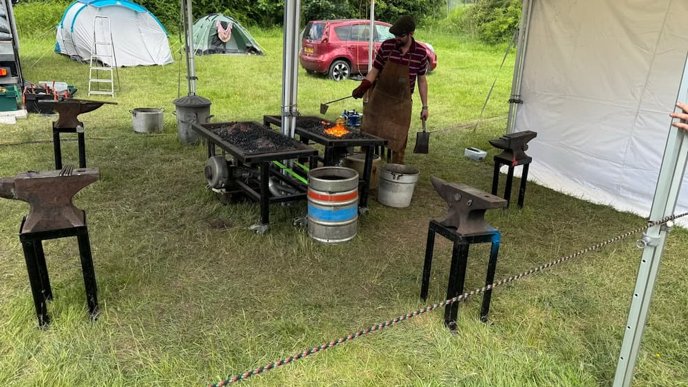

Last weekend I finally went to my first ever [EMF Camp](https://www.emfcamp.org/) after wanting to go for 4+ years now. I had a thoroughly good time while I was there and wanted to share my experience to encourage others to go in the future.

## What is it?

For those that don't know, the event is described as "Electromagnetic Field is a non-profit camping festival for those with an inquisitive mind or an interest in making things". What this _basically_ means is it's a multi-day camping festival for nerds of all kinds! The event takes places from Thursday to Monday (if you want to stay that long) in a large deer park in Eastnor in a lovely part of the UK. Throughout the long weekend you will be able to attend [talks and workshops](https://www.emfcamp.org/schedule/2024) on a large range of diverse and interesting topics, dance and party the night away at a couple different music areas, play some fun and geeky games around the site and marvel at the creativity and imagination of the other attendees and their installations.

The event is 100% run by volunteers and a lot of love and effort goes into making it successful for everyone. All attendees are encouraged to volunteer for a shift helping out at various things around the site from bar shifts to infrastructure support.

## The run-up

As this was my first time I was quite anxious in the run up to it as I'm not really one for camping or for festivals but I was very excited that several people I knew were also going, including several old friends from my JSOxford days! 💙

<figure class="center" markdown="1">

<figcaption>Mini JSOxford reunion!</figcaption>
</figure>

I was also helping [Sam Machin](https://k8s.social/@sammachin@chaos.social) with some of the phone infrastructure for the event by setting up and configuring a Kubernetes cluster that ran on-site and handled almost all of the applications that allowed the various telephone networks to work and be built on top of. As I'm sure you can imagine, I really enjoyed helping out with this and already have a bunch of ideas on how to make it better and more reliable for the next event! We did have to deal with a couple bugs during the weekend but for the most part it went well! 😅

## On-site

The main thing you'll notice while walking around the site is that there is no shortage of interesting things to look at or interact with. Some of the things are organised by the event and others are just cool things that people have brought along with them for the enjoyment of others.

Some highlights include...

<figure class="center" markdown="1">

<figcaption>A light up van with controlable lights from a web app!</figcaption>
</figure>

<figure class="center" markdown="1">

<figcaption>Blacksmithing!</figcaption>
</figure>

<figure class="center" markdown="1">

<figcaption>Lasers!!!</figcaption>
</figure>

<figure class="center" markdown="1">

<figcaption>A musical Tesla coil</figcaption>
</figure>

<figure class="center" markdown="1">

<figcaption>Duck Hunt! With LASERS!</figcaption>
</figure>

... plus many more cool, interesting and striaght up weird and wonderful things.

One thing EMF Camp has that you likely won't see at many other festivals is a very impressive amount of network infrastructure that serves the whole site. Almost the entire site is covered in [WiFi](https://www.emfcamp.org/about/internet) backed by a 40Gb fibre connection to the internet (into the middle of a field!!! 🤯) that is useable by all attendees. The site is also covered in an impressive network of [phone systems](https://www.emfcamp.org/about/phones) operated by the POC (Phones Operations Centre) that includes DECT coverage on the whole site, the ability to use SIP clients, a plain old telephone service and a 2G GSM network. It was also possible for attendees to build apps using the phone network that other attendees can then use over the weekend. Along with all of this was a fantastic network of [electric](https://www.emfcamp.org/about/power) hookup points across the site for all to use that ended up leading to my most millennial camping experience..

<figure class="center" markdown="1">

<figcaption>Breakfast was easy with an AirFryer</figcaption>
</figure>

While talking about food it's worth noting that the [food and drink](https://www.emfcamp.org/about/food) options on site were amazing. There was several fantastic food stalls open most of the time and there was two bars available to get drinks from.

<figure class="center" markdown="1">

<figcaption>This was so delicious I had to get it again the next day!</figcaption>
</figure>

While I didn't get to see as many talk as I might have liked (the seats weren't very comfortable) I did manage to get to see some of my wonderful friends speak!

<figure class="center" markdown="1">

<figcaption>

[Jo Franchetti - Is everything difficult, or is it just me?](https://www.emfcamp.org/schedule/2024/321-is-everything-difficult-or-is-it-just-me)

</figcaption>
</figure>

<figure class="center" markdown="1">

<figcaption>

[Terence Eden - Lessons learned Open Sourcing the UK's Covid Tracing App](https://www.emfcamp.org/schedule/2024/16-lessons-learned-open-sourcing-the-uks-covid-tracing-app)

</figcaption>
</figure>

I also managed to catch a showing of "[An Evening Of Unnecessary Detail](https://festivalofthespokennerd.com/show/an-evening-of-unnecessary-detail/)" which I very much enjoyed.

<figure class="center" markdown="1">

<figcaption>An Evening Of Unnecessary Detail</figcaption>
</figure>

## Things I think could be improved

On the whole everything I experienced was great! There's only some very minor annoyances that I'd like to see improved next time around.

While the toilets on site were quite nice (besides the fetilizer ones that grossed me out) I found them quite tight to squeeze into. Not a big deal compared to camping I've done in the past though.

There was a "night market" on site where some vendors were set up selling some funky, geeky crafts. I loved this idea but the room they were in was so small and crowded that I couldn't handle being in there for very long at all. It was a shame as I'd have liked to have chatted with some of the vendors while I was there.

As a non-(alcoholic)-drinker I would have liked to have seen more non-alcoholic options available in the bars. The selection they had was perfectly fine, it just would have been nice to have some 0% beers or similar.

The programmable badges had issues. This was kinda to be expected as they were brand new and very ambitious but it was still frustrating not really being able to use them right away. I'm looking forward to re-using mine in 2026 when I'm sure the software will be rock solid!

Not something for the event itself to improve on but something for me next time - I'd like to take part more in the various activities around the site. I was taking things steady this year as I didn't want to get overwhelemd by everything but I do now wish I took part in the Clippy Murder Mystery or the capture the flag style game with the badges. There's so much going on all over the site that you're bound to miss out on something you wish you'd managed to do.

## Summary

If it wasn't obvious by now I had a fantastic weekened at EMF Camp and will certainly be attending the next one in 2026 if possible. I hope to see even more of my friends (new and old) there so we can hang out and nerd out on all the cool experiences that EMF Camp has on offer.
